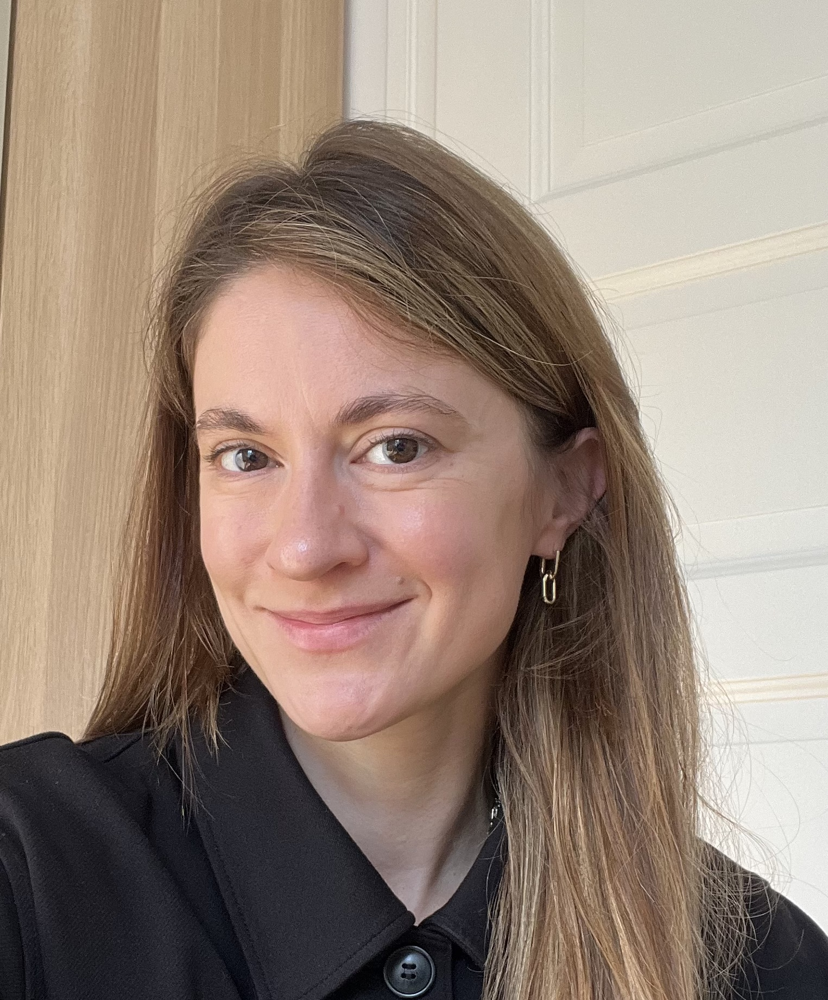

# Build AI solutions that work for your business

### I help you move from AI hype to real results

- Struggling to figure out where AI actually fits in your business?
- Drowning in vendor pitches but need someone who speaks both tech and strategy?
- Want to build your first AI system?
- Need a freelancer who can code the solution and train your team?

[Book Free Intro Call :material-arrow-top-right:](https://calendly.com/kate-data/introduction-call){ .md-button .md-button--primary }

{ .profile-image alt="Portrait of Katharina Schachmatov, AI entrepreneur"}

## About me

Hi! I’m Katharina, a freelance AI engineer based in Berlin.
I help companies cut through AI hype and build solutions that actually work — RAG systems, LLM applications, document processing, and intelligent automation.

My approach: Understand the problem deeply, work with the data you have (not the data you wish you had), and ship pragmatic solutions your team will actually use.

What makes me different:

I’ve been exploring generative AI since 2019 — back when we were using GANs, 3 years before ChatGPT made it mainstream. I’ve spent nearly 10 years across healthcare, startups, and retail learning one critical lesson: the best AI projects start with good data and people willing to adapt the technology, not fancy models.

I’m not the person who built AI at scale at Google. I’m the person who helps mid-sized and small companies actually get started.

My background:
	•	Built production ML pipelines for certified medical AI devices (FHIR, GDPR-compliant)
	•	Designed and taught 20-hour data science courses to 100+ managers and engineers
	•	Delivered AI strategy workshops and proof-of-concepts across multiple industries
	•	Currently focused on RAG systems, chatbots, and document intelligence using OpenAI, Claude, and open-source models

My tech stack: Python, PostgreSQL, LangChain, OpenAI/Claude APIs, FastAPI, Docker, Pinecone/Weaviate, MLFlow

## Why work with me?

Here's why I'm the right fit and what you'll gain from working together:

-   :material-rocket:{ .lg .middle } Fast Implementation & Strategy

    ---

    I can evaluate your use case, recommend an approach, and build it. Most consultants do one or the other. I do both. Whether you need a workshop to figure out where AI fits or hands-on engineering to ship a prototype, I’ve got you covered.

-   :material-lightbulb:{ .lg .middle } Pragmatic, Not Perfectionist

    ---

    I'm a practitioner, not just a theorist. I recently transitioned to freelancing after building real AI systems, so I understand both the technical challenges and the business impact. Whether it's RAG implementation, LLM integration, or data pipeline optimization, I bring battle-tested solutions to the table.

-   :material-chat-processing:{ .lg .middle } Clear Communication

    ---

    I break down complex AI concepts into clear, actionable insights. You'll always understand the 'why' behind technical decisions. I provide regular progress updates, thorough documentation, and collaborate closely with your team to ensure we're aligned every step of the way.

-   :material-school:{ .lg .middle } Continuous Learning & Innovation

    ---

    I’ve trained 100+ people in data science and ML. I don’t just hand you code—I explain the why behind decisions, document everything (using MkDocs), and make sure your team can maintain what we build. I see the big picture while debugging the details. Early AI adopter who’s stayed current through every wave (GANs → Transformers → LLMs). AI moves fast, and so do I.

<!-- ## What my past clients say about my work

-   :material-format-quote-open:{ .lg .middle } Adrian Dragomir
    
    Founder at Sferal

    ---

    "Dave is a true professional and my collaboration with him has been flawless. **He took his time and spent 3 days with me and my team in Mamaia, Romania where he was a guest for 3 sessions of my podcast Waves of AI**. He is one of the most competent people I know that has a real understanding of how AI works and how to integrate it quickly in your company."

-   :material-format-quote-open:{ .lg .middle } Barbara van den Bosch
    
    Founder at Viverve

    ---

    "Together with Datalumina, we developed a tailor-made program where I, as a school leader, can now bring together vast amounts of information in one place and automate key tasks. **Beyond the tremendous quality improvement for our organization, working with Datalumina was an extremely pleasant experience**."

-   :material-format-quote-open:{ .lg .middle } Rene Raaphorst
    
    Founder at Crypto Insiders

    ---

    "My experience with Datalumina has been excellent. **They think along with you every step of the way, from proof of concept to a fully functional product**. I was amazed by the quality of the results and found the collaboration very enjoyable. I highly recommend Dave and Datalumina to everyone!"

-   :material-format-quote-open:{ .lg .middle } Kelsen
    
    Founder at Datavisum

    ---

    "I am thankful for having come across Dave and Data Freelancer, it was one of the best investment decisions I've made in 2024. **From effective ways to create inbound marketing strategies using social media, through solution architecture design to address all kinds of business challenges**, you will extract a great deal of value from diverse perspectives."

 -->

## Frequently asked questions

??? note "How quickly can you start working on my project?"
    I'm usually ready to kick off new projects within 1-2 weeks after we finalize the contract. If you're working against a tight deadline, I'm happy to discuss accelerated timelines—just give me a heads up during our first conversation about what you're working with.
??? note "Do you require a minimum project size or commitment?"
    I work with projects of all sizes, but I've found that around 20 hours is the sweet spot to really dig into your challenge, understand your data landscape, and deliver solutions that actually move the needle. If you're unsure about fit, we can always start with a smaller pilot to see if we click.
??? note "What industries have you worked in?"
    I've tackled projects in healthcare, retail, and insurance. While the fundamentals of data work transcend industries, I've built particular expertise in understanding customer behavior, streamlining operations, and building predictive models that drive real business outcomes.
??? note "How do you handle data security and confidentiality?"
    Data security isn't negotiable for me. I sign NDAs as standard practice, encrypt all data in transit, and adhere to industry security standards. I'm also comfortable integrating with your existing security setup and compliance requirements—we can work however makes you most comfortable.
??? note "What's your pricing model?"
    I offer both project-based and ongoing retainer options. Project pricing reflects the scope, complexity, and value you'll get—not just hours on the clock. For continuous support, I design retainers that fit your actual needs. Let's talk about your situation and find an approach that makes financial sense.
??? note "How do you keep me in the loop?"
    I believe in transparency. You'll get weekly updates on progress, regular sync meetings, and thorough documentation of everything we discover and build. For longer engagements, I set up dashboards and reports so you can see results as they happen, not just at the end

-   :material-coffee:{ .lg .middle } Let's have a virtual coffee together!

    ---
    
    Want to see if we're a match? Let's have a chat and find out. Schedule a free 30-minute strategy session to discuss your AI challenges and explore how we can work together.

    [Book Free Intro Call :material-arrow-top-right:](https://calendly.com/kate-data/introduction-call){ .md-button .md-button--primary }

