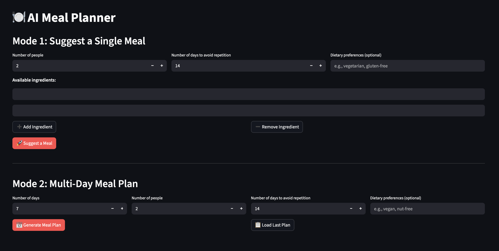

# AI-Powered Meal Planning Assistant


??? tip "Portfolio Best Practices"
    This is a portfolio project demonstrating RAG implementation and full-stack AI development. Key highlights:
    
    - End-to-end RAG pipeline with semantic search
    - PostgreSQL + pgvector for production-grade vector storage
    - Structured outputs using Pydantic models
    - Docker-based deployment with service orchestration
    - Clean separation of concerns (UI, business logic, data layer)
    - Scalable architecture supporting 2M+ recipe embeddings

!!! abstract "Project Summary"
    **Project**: MealPrep - AI Meal Planning Assistant  
    **Repository**: [GitHub](https://github.com/KSchachmatov/mealprep)  
    **Category**: Personal AI Application  
    
    **Key Features**:
    
    - Semantic search across 2.2M+ recipes using RAG
    - Single meal suggestions based on available ingredients
    - Multi-day meal plan generation with shopping lists
    - Real-time meal regeneration with diversity enforcement
    - PostgreSQL database with meal plan persistence
    - Built from scratch in 1 week

An intelligent meal planning application that combines Retrieval-Augmented Generation (RAG) with Large Language Models to deliver personalized meal suggestions and automated weekly meal plans based on available ingredients and dietary preferences.

## Challenge

Planning meals daily is time-consuming and often results in repetitive choices. Existing meal planning apps lack:

- **Intelligent suggestions** based on what you already have
- **True variety** - they suggest similar meals repeatedly
- **Flexibility** - rigid plans that don't adapt to rejections
- **Semantic understanding** - can't find similar recipes or adapt to preferences

The goal was to build an AI-powered solution that understands context, ensures variety, and learns from user preferences while leveraging a massive recipe database.

## Our Approach

Developed a full-stack RAG application with two distinct modes:

**Mode 1: Single Meal Suggestion**

- Ingredient-based semantic search through 2M+ recipes
- RAG pipeline retrieves similar recipes as context
- LLM (OpenAI GPT-5-mini) generates personalized suggestions considering dietary preferences
- Accept/reject workflow with automatic diversity enforcement

**Mode 2: Multi-Day Meal Planning**

- Automated generation of X day meal plans
- Individual meal acceptance/rejection with on-the-fly regeneration
- Shopping list aggregation from accepted meals
- Plan persistence with database storage

**Technical Implementation:**

- Embedded 2.2M recipes using sentence-transformers (text-embedding-3-small)
- Vector similarity search with pgvector and PostgreSQL
- Structured outputs using Pydantic for reliable parsing
- Prompt engineering for diversity and creativity

## Results & Impact

- Successfully processes 2.2M+ recipe embeddings
- Sub-second semantic search response times
- Reliable structured outputs using Pydantic validation
- Meal plan generation in under 30 seconds for 7-day plans
- Docker deployment with persistent storage
- Clean architecture enabling easy feature additions

## Solution Overview

### Architecture

```
┌─────────────┐
│  Streamlit  │  UI Layer
│     UI      │
└──────┬──────┘
       │
┌──────▼──────────┐
│  Meal Service   │  Business Logic
│   (RAG Flow)    │
└──────┬──────────┘
       │
┌──────▼──────────┐     ┌─────────────┐
│ Vector Store    │────▶│  PostgreSQL │
│  (pgvector)     │     │  + pgvector │
└─────────────────┘     └─────────────┘
       │
┌──────▼──────────┐
│   Claude API    │  LLM Generation
│   (Sonnet 4)    │
└─────────────────┘
```

### RAG Pipeline

1. **Indexing Phase**:

   - Load 2.2M recipes from Kaggle dataset
   - Generate embeddings using sentence-transformers
   - Store in PostgreSQL with pgvector extension

2. **Retrieval Phase**:

   - User inputs ingredients
   - Semantic search finds similar recipes (cosine similarity)
   - Top-k results retrieved as context

3. **Generation Phase**:

   - Similar recipes passed to OpenAI as system context
   - Prompt includes ingredients, dietary preferences, excluded meals
   - Structured output ensures consistent parsing

4. **Diversity Enforcement**:

   - Recent meals tracked in database
   - Rejected meals added to exclusion list
   - Prompt explicitly instructs variety across cuisines and methods

## Tech Stack

**AI & Machine Learning**

- OpenAI GPT-5-mini for meal generation
- sentence-transformers (text-embedding-3-small) for embeddings
- pgvector for vector similarity search
- Custom RAG pipeline implementation

**Backend**

- Python 3.12
- Streamlit for rapid UI development
- PostgreSQL with pgvector extension
- Pydantic for data validation
- psycopg2 for database connectivity

**Data Processing**

- Pandas for recipe data manipulation (added diet classifications)
- 2.2M recipe dataset from Kaggle

**Infrastructure**

- Docker & Docker Compose for service orchestration
- uv for fast Python package management
- python-dotenv for configuration management

**Development**

- Git for version control
- Structured project layout with separation of concerns

## Additional Context

- **Timeline**: 1 week
- **Team Size**: Solo project
- **Role**: Full-stack AI Engineer
- **Dataset**: 2.2M+ recipes from Kaggle
- **Learning Focus**: Production RAG implementation, vector databases, structured outputs

**Future Enhancements:**

- Shopping list integration with grocery apps
- MCP (Model Context Protocol) integration with growing RAG database (see below)
- Advanced text chunking for recipe processing
- PDF cookbook parsing
- Nutritional tracking
- Calendar integration for meal scheduling

## Learnings & Insights

**Technical Challenges Solved:**

1. **Scale**: Efficiently embedding and searching 2M+ recipes
2. **Parsing Reliability**: Structured outputs improved parsing
3. **Diversity**: Prompt engineering crucial for non-repetitive suggestions
4. **State Management**: Streamlit session state for complex workflows

**Key Takeaways:**

- RAG quality depends heavily on retrieval strategy
- Prompt engineering is as important as model choice
- Structured outputs essential for production reliability
- Docker simplifies local development and deployment

<div class="grid cards" style="margin-top: 3rem" markdown>

-   :material-coffee:{ .lg .middle } Let's have a virtual coffee together!

    ---
    
    Want to see if we're a match? Let's have a chat and find out. Schedule a free 30-minute strategy session to discuss your AI challenges and explore how we can work together.

    [Book Free Intro Call :material-arrow-top-right:](https://calendly.com/kate-data/introduction-call){ .md-button .md-button--primary }

</div>